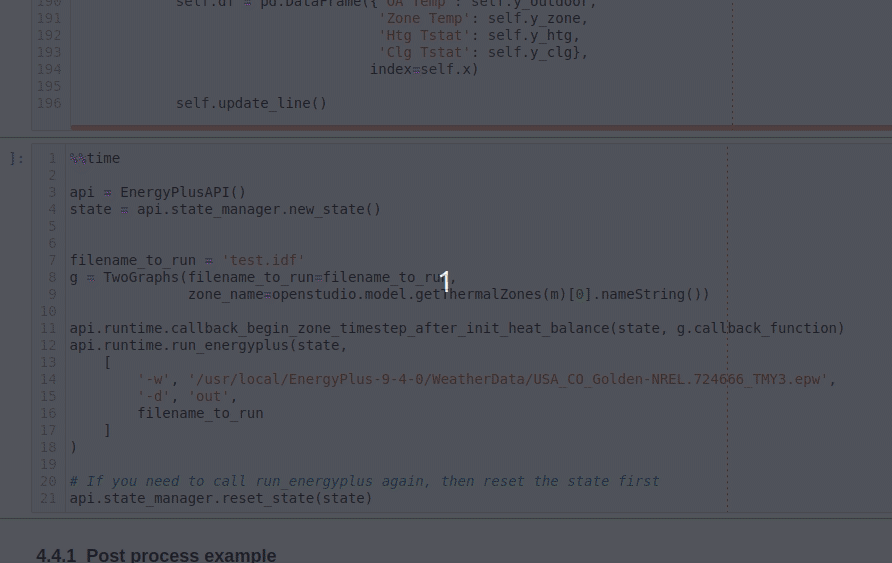

# Python: using OpenStudio Bindings, EnergyPlus API, and matplotlib

Written By Julien Marrec of [EffiBEM](https://www.effibem.com), circa 2021-01-05.

## Purpose

This notebook aims to demonstrate the use of:

* **The OpenStudio Python Bindings**.
    * This is used to efficiently create and customize a model to be simulated

    * **Note**: Until a version > 3.1.0 (eg 3.1.1 or 3.2.0) is out on [**pypi**](https://pypi.org/project/openstudio/), I recommend using the [**testpypi**](https://test.pypi.org/project/openstudio/) version where I made usability adjustments. You can do `pip install -i https://test.pypi.org/simple/ openstudio` for that one.

* **The EnergyPlus Python API**, and how to use callbacks to retrieve data

* **Updating a live matplotlib plot during E+ simulation** via the EnergyPlus Python API callback.

Several options and examples are shown below. **I strongly recommend you encapsulate your data inside a class** (see section 3.4) instead of relying on python `global` data, but it does bring a sligthly higher complexity level so for simple stuff you can ommit that and use 3.1 to 3.3 instead (which are also used as an entry point to demonstrate the API)

----

**Resources:**

* OpenStudio SDK documentation: https://openstudio-sdk-documentation.s3.amazonaws.com/index.html
* EnergyPlus Python API documentation: https://energyplus.readthedocs.io/en/latest/api.html

## Demo

